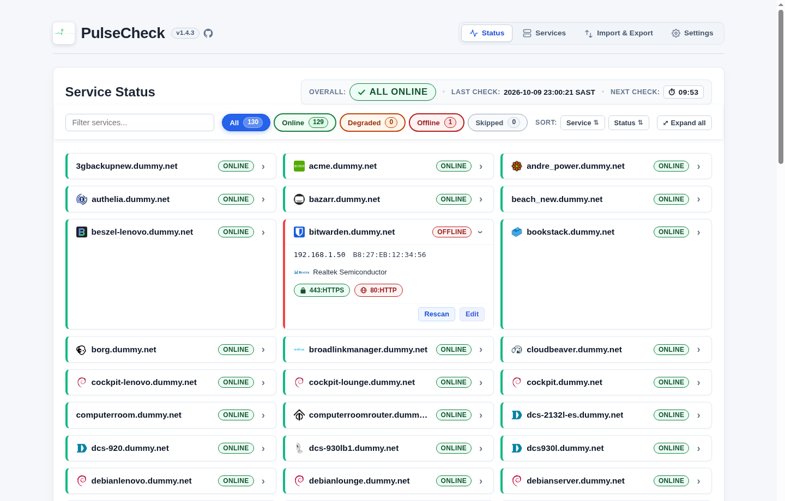
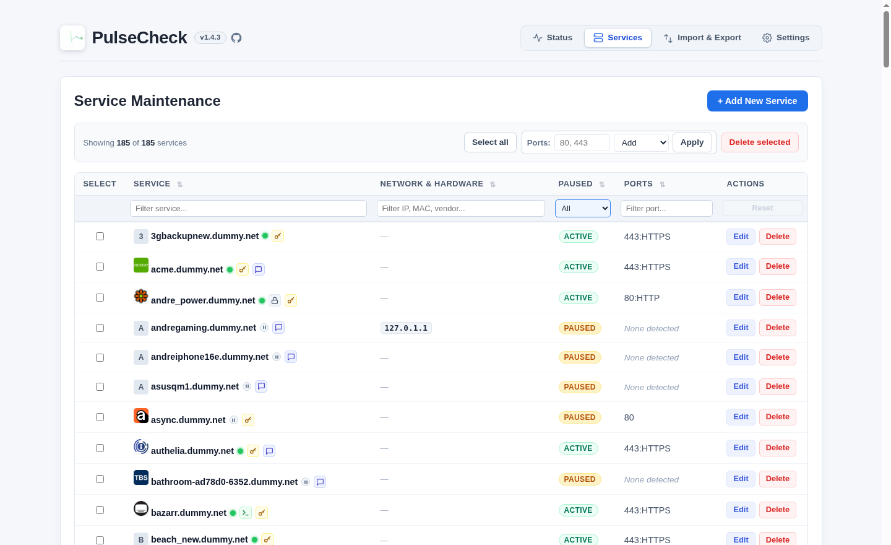
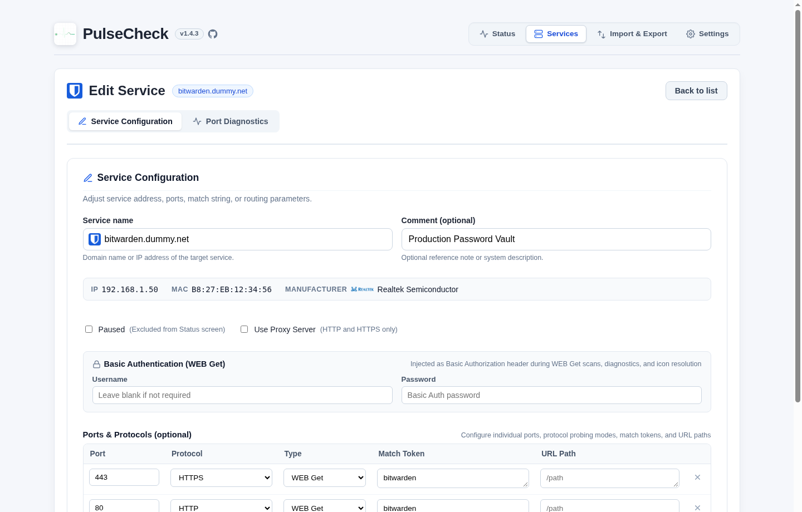
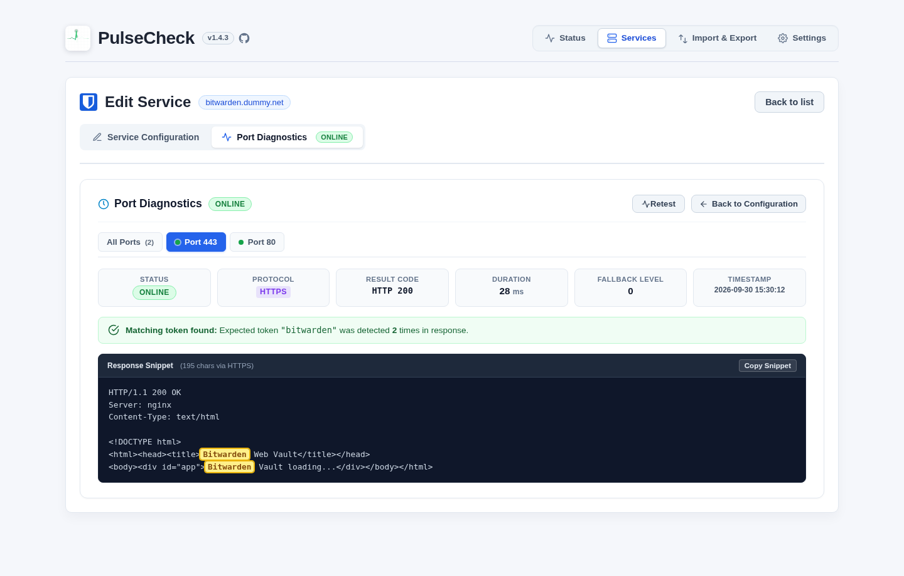
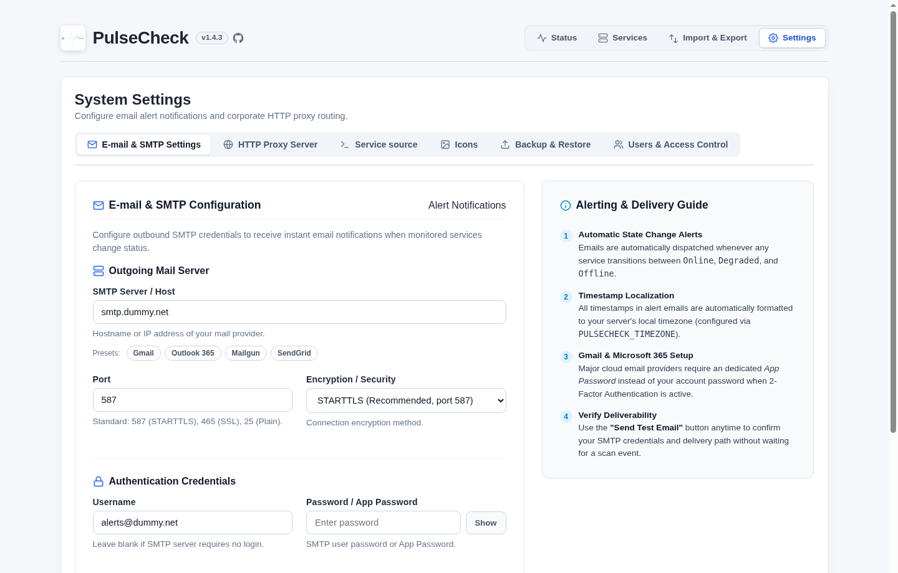
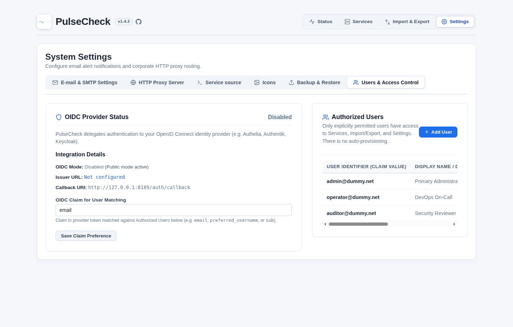
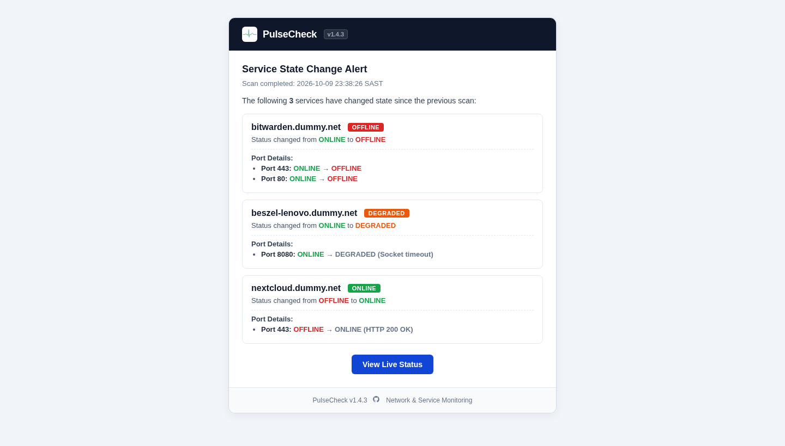
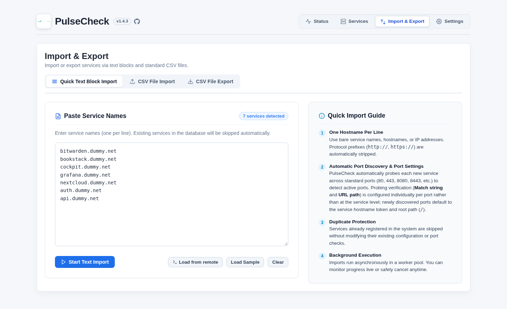

# PulseCheck

> [!NOTE]
> **AI Vibe Coding Project**  
> This entire project was created through AI Vibe Coding using the **Antigravity IDE** powered primarily by Google DeepMind's **Gemini** models.

PulseCheck is a lightweight, Linux-friendly web application and monitoring daemon that stores services in SQLite, discovers open ports, and monitors the health and availability of those services on an automated schedule.

<p align="center">
  
</p>

---

## Interface & Key Functions

### 1. Live Status Dashboard
Real-time monitoring overview displaying service availability, countdown timer to the next background scan, two-tone filter pills, expandable service tiles, network discovery metadata, and per-port protocol micro-badges.

<p align="center">
  
</p>

- **Enlarged Overall Health Indicator**: Prominent header status badge with dedicated status SVGs (**✓ GREEN = ALL ONLINE**, **⚠ ORANGE = SOME DEGRADED**, **✕ RED = SOME OFFLINE**), sized 50% larger with dark contrasting borders.
- **Next Check Countdown**: Digital countdown timer updated every second showing time remaining until the next scan run.
- **Status Filter Pills**: Quick one-click state filtering (**All**, **Online**, **Degraded**, **Offline**, **Skipped**) with live count badges and dark borders.
- **Sort & Collapse Controls**: One-click sorting by **Service** or **Status** severity, plus an **Expand all / Collapse all** (`⤢` / `⤡`) toggle button with persistent session memory.
- **Expandable Service Tiles with Network Discovery**: Click any tile to reveal resolved **IP address**, Layer 2 **MAC address**, and **Manufacturer name with brand logo** alongside monitored port chips.
- **Clean Protocol Micro-Icons**: Status port chips feature protocol micro-icons (`🌐 HTTP`, `🔒 HTTPS`, `🔌 Socket`, `⚡ UDP`, `ﮩ٨ـ ICMP Ping`) with clean status color coding, keeping cards clutter-free without repetitive status text.
- **Rich Status Hover Tooltips**: Hovering or focusing any port chip displays latency in milliseconds, probe result code, server-local check timestamp, URL path, and configured match string.

### 2. Service Inventory & Management
Centralized directory for viewing and maintaining all monitored services with instant column-based search and bulk controls.

<p align="center">
  
</p>

- **Interactive Column Filters**: Real-time filtering by service name, paused state, and port numbers.
- **Per-Port Details on Hover**: Hovering over any entry in the **PORTS** column displays the individual port configuration including protocol, per-port Match string, and URL path.
- **Bulk Port Operations**: Batch add or remove ports across multiple selected services simultaneously.
- **Pause & Resume**: Temporarily bypass monitoring for specific services without deleting records or historical data.

### 3. Service Workflows, Network Discovery & Live Diagnostics
Dedicated tabbed workflow for adding and editing services with automated network discovery (IP, MAC, hardware manufacturer and cached logos), multi-port protocol configuration, and pre-flight diagnostic probing.

<p align="center">
  
</p>

<p align="center">
  
</p>

- **Dedicated Tabbed Interface**: Clean segmented tabs separate **Service Configuration** from **Port Diagnostics**, giving full card width to the Ports & Protocols table.
- **Automatic Network Discovery**: Shows resolved **IP**, **MAC address**, and NIC **Manufacturer** with brand logo (with local disk caching and smart vendor aliases e.g. Routerboard &rarr; MikroTik).
- **Per-Port Match & URL Path Configuration**: Configure independent **Protocol**, **Match strings**, and **URL paths** for every individual TCP/UDP port in the spacious Ports table without horizontal scrolling.
- **Pre-Flight Probe Testing**: Test connectivity, HTTP response codes, latency, and match string tokens directly against unsaved form inputs — clicking "Test Probes" automatically navigates to Port Diagnostics.
- **Tabbed Port Inspector**: Switch between individual port tabs or the "All Ports" summary table with status indicators, result codes, latency, and local timestamps.
- **Response Token Highlighting**: Scrollable dark console viewer displaying HTTP headers and response body with matching tokens highlighted in real time.

### 4. System Settings & SMTP Configuration
Centralized settings for automated notification dispatch, test emails, HTTP proxy configuration, and encrypted backup/restore.

<p align="center">
  
</p>

- **Outgoing SMTP Server**: Support for STARTTLS (port 587), SSL/TLS (port 465), or plain authentication with password protection.
- **Automatic State Change Alerts**: Dispatches notifications when services transition between states (e.g. Online &rarr; Degraded, Degraded &rarr; Offline).
- **Send Test Email**: Built-in verification tool to validate SMTP credentials and delivery path immediately.
- **HTTP Proxy Server**: Centralized proxy configuration with per-service routing toggles.
- **Encrypted Backup & Restore**: AES-256-GCM encrypted backup of all system settings and authorized user registries with automatic server reboot.

### 5. Access Control & OpenID Connect (OIDC) Authentication
Protect administrative views with your corporate or self-hosted identity provider (Authelia, Authentik, Keycloak).

<p align="center">
  
</p>

- **Public Status Dashboard by Default**: Live health indicators, service statuses, and check states remain publicly readable without requiring a login.
- **Protected Administrative Endpoints**: Clicks on **Services**, **Import & Export**, or **Settings** seamlessly redirect unauthenticated visitors to your OIDC provider login and return them to their destination upon successful sign-in.
- **Strict Authorization Registry (No Auto-Provisioning)**: Only explicitly approved accounts listed in PulseCheck's **Authorized Users** table are granted access.
- **Configurable Claim Matching**: Match incoming tokens against user records using configurable claims (default `email`, or `preferred_username`, `sub`).
- **User Administration**: Add, update, and revoke authorized users directly from the Settings interface.
- **Initial Admin Bootstrapping**: Optional `PULSECHECK_OIDC_INITIAL_ADMIN` seeds the first administrator to prevent lockout when booting on clean installations.

### 6. Automated Email Alerts
Modern responsive HTML alert notifications dispatched to your inbox whenever a monitored service changes state.

<p align="center">
  
</p>

- **Instant State Transitions**: Shows previous and updated health statuses with distinct color badges (**ONLINE**, **DEGRADED**, **OFFLINE**).
- **Per-Port Change Breakdown**: Displays individual port and protocol failure reasons (e.g. Socket timeout, HTTP status code change).
- **One-Click Portal Access**: Direct "View Live Status" CTA button jumping straight to your PulseCheck dashboard.
- **Branded Header & Footer**: Clean dark header with embedded logo and version, plus direct GitHub project link in the footer.

### 7. Data Import & Export
Rapid onboarding and data portability through raw text blocks and standard CSV files.

<p align="center">
  
</p>

- **Quick Text Block Import**: Paste raw lists of service hostnames for rapid onboarding with automatic multi-port discovery and default per-port settings.
- **CSV Import & Export**: Import and export service inventories with per-port match tokens, URL paths, and protocols positionally aligned to ports.

---

## Key Features

- **Automated Health Monitoring**:
  - Scheduled scans run in the background (default every 10 minutes) across all active services.
  - Multi-threaded parallel scanning with configurable retry attempts and backoff intervals.
  - HTTP and HTTPS protocol verification with redirection handling (up to 5 hops).
  - Prepending of response headers to decompressed response bodies for full-header keyword matching (e.g. matching `Server`, `X-Powered-By`, or custom response headers).
  - Automatic gzip payload decompression and legacy TLS handshake fallback for older appliances.
  - Optional raw TCP socket fallback for non-HTTP services.
  - Integrated ICMP ping probe option for hosts without open listening TCP/UDP ports.

- **Network Discovery & Hardware Manufacturer Identification**:
  - Automatic resolution of local host IP addresses and Layer 2 ARP MAC addresses.
  - Identification of NIC manufacturer with automated brand logo retrieval and local caching (`/manufacturer_icons`).
  - Pre-cached assets and direct fallbacks for major networking and server brands (Apple, MikroTik, Realtek, Dell, HP, Intel, Cisco, Ubiquiti, etc.).
  - Displayed inline on Add/Edit service configuration and inside expanded Status tiles.

- **HTTP Proxy Support**:
  - Global HTTP proxy server configuration (host/IP, port, optional username, and password).
  - Per-service **Proxy Server** toggle (`use_proxy`) to direct all HTTP and HTTPS requests through the proxy.
  - Supports HTTP forward proxying and HTTPS `CONNECT` tunneling with optional Basic authentication.

- **Email Alerts & Notifications**:
  - Configurable outgoing SMTP settings (STARTTLS, SSL/TLS, or plain) with password encryption/storage.
  - State change notifications: automatically sends email alerts when any monitored service changes state (e.g. Online &rarr; Degraded, Degraded &rarr; Offline).
  - Color-coded status badges next to service names: **OFFLINE** (red `#dc2626`), **DEGRADED** (orange `#ea580c`), and **ONLINE** (green `#16a34a`).
  - Resized and optimized branded email header with embedded EKG logo and application version badge.
  - "Send Test Email" feature directly from the Settings interface.

- **Service Management & Live Diagnostics**:
  - Maintain services with Add, Edit, Delete, and manual Rescan actions.
  - **Full-Screen Service Workflows & Live Port Diagnostics ("Test Probes")**:
    - Dedicated 2-column full-screen layouts for both **Add New Service** and **Edit Service** with responsive proportions.
    - **Per-Port Probing Settings**: Match strings and probe URL paths are stored individually per port, permitting distinct health check paths (e.g. port 80 at `/` and port 8080 at `/health`) and distinct verification tokens on the same host.
    - Test probe connections live against unsaved form values before saving changes (instant verification during creation or editing).
    - Pre-filled sensible port defaults (`80, 443`) on Add Service with optional port overrides or automatic discovery.
    - Tabbed per-port diagnostic inspector with status dots, HTTP/error result codes, call duration (ms), retry counts, and local timestamps.
    - Scrollable response snippet viewer (headers + body) with automatic **highlighting of matching tokens**.
    - "All Ports" summary comparison table.
  - Bulk port management: add or remove ports across multiple selected services simultaneously, or perform bulk deletion.
  - Interactive column filters (Service, Paused/Active status, and Ports) with URL query parameter preservation.
  - Per-port configuration tooltips on hover in both the Services table and Status table.
  - Pause individual services to temporarily bypass monitoring without deleting records.

- **Live Status Dashboard & Real-Time Schedule**:
  - Responsive grid layout displaying all active services and their monitored ports with tile expand/collapse.
  - **Header Status Bar**:
    - **Overall Health Indicator**: Enlarged (50% larger) color-coded system badge with status SVGs (**✓ GREEN = ALL ONLINE**, **⚠ ORANGE = SOME DEGRADED**, **✕ RED = SOME OFFLINE**), ignoring services without ports listed.
    - **Last Scheduled Check**: Server local timezone formatted timestamp of the most recent background run.
    - **Next Check Countdown**: Digital countdown timer updated every second showing time remaining until the next scan.
    - **Automatic Screen Refresh**: Seamlessly polls and reloads the screen as soon as the scheduled background run finishes and database records are updated.
  - **Color-Coded Status Filter Pills**: Two-tone shaded pills with dark outlines for quick filtering and live counts: **BLUE = ALL**, **GREEN = ONLINE**, **ORANGE = DEGRADED**, **RED = OFFLINE**, and **GRAY = SKIPPED**.
  - **Expand all / Collapse all Toggle**: Expand or collapse all service cards simultaneously with session persistence.
  - **Visual Protocol Port Badges**: Clean port pills with inline protocol symbols and status border/background styling.
  - **Discovered Host Details**: Compact display of IP address, MAC address, and manufacturer logo/name directly below service names.
  - Interactive tooltips showing the last successful check timestamp, round-trip response latency (in ms), configured URL path, and Match token.
  - Application version display (`v1.1.5`) in the web UI header and alert notification emails, configurable via environment variable.

- **Data Import & Export**:
  - **CSV File Export**: Download all saved services and configurations in a single standard CSV file with per-port Match tokens, URL paths, and protocols.
  - **CSV File Import**: Upload service lists with duplicate skipping, positional per-port parsing, and background progress tracking with cancel capability.
  - **Quick Text Block Import**: Paste raw lists of service hostnames for rapid onboarding with automatic port discovery.

---

## Getting Started

### Local Environment

1. **Clone repository and set up virtual environment**:
   ```bash
   git clone https://github.com/diepeterpan/pulsecheck.git
   cd pulsecheck
   python3 -m venv .venv
   source .venv/bin/activate
   pip install -r requirements.txt
   ```

2. **Run PulseCheck (Standard Mode)**:
   ```bash
   python app.py
   ```
   *When running in an interactive terminal, the console menu will appear.*

   **Or Run in OIDC Development Mode**:
   ```bash
   ./run_dev_oidc.sh
   ```
   *Automatically creates `.env.oidc` from `.env.oidc.example` on first run to configure Authelia, Authentik, or Keycloak.*

3. **Access the Web Interface**:
   Open your browser at [http://127.0.0.1:8182](http://127.0.0.1:8182).

### Docker Compose

Run PulseCheck directly with persistent storage and automatic restarts:

```bash
docker compose up -d --build
```

The application runs in headless mode inside the container and is immediately accessible on [http://127.0.0.1:8182](http://127.0.0.1:8182).

> [!IMPORTANT]
> **MAC Address & Manufacturer Resolution in Docker:**
> By default, Docker containers run in isolated bridge networking mode (`bridge`), meaning the container has its own private network stack and ARP table. It can resolve hostnames to IP addresses, but it cannot see the Layer 2 MAC addresses of devices on your physical local area network (LAN).
>
> If MAC address and manufacturer resolution is needed, the **easiest and recommended solution** is to run the container in **Host Networking Mode**.
>
> In `docker-compose.yaml`, add `network_mode: host` and remove the `ports` mapping:
>
> ```yaml
> services:
>   pulsecheck:
>     container_name: pulsecheck
>     image: pulsecheck:latest
>     network_mode: host
>     # Note: Remove or comment out 'ports:' when using network_mode: host
>     # ports:
>     #   - "8182:8182"
>     environment:
>       - PULSECHECK_PORT=8182
>       ...
> ```
>
> **Alternative Methods:**
> - **MACVLAN / IPVLAN Network**: If you want to keep container network isolation while providing direct Layer 2 access to the physical network, configure a Docker [macvlan network](https://docs.docker.com/engine/network/drivers/macvlan/). This assigns the container its own dedicated IP and virtual MAC address directly on your physical LAN subnet.
> - **Bare-Metal / Systemd**: Running PulseCheck directly on the host OS via a Python virtual environment automatically shares the host's ARP table with zero extra configuration.

---

## Interactive Console Menu

When launched directly in an interactive terminal (non-headless), PulseCheck displays a startup menu:

```text
PulseCheck menu
1. Start web app
2. Start web with Explicit debugging
3. Start web with Line-Profiler (profiles scan lines & elapsed CPU/time)
4. Exit
```

- **Option 1**: Starts the Flask web server with standard production output.
- **Option 2**: Starts the web server with verbose protocol-level debug logging for HTTP, HTTPS, sockets, proxy routing, and SSL handshakes.
- **Option 3**: Starts the web server with **Python Line-Profiler** enabled. Measures exact execution counts, microsecond durations, and percentage of time spent on every line of code across scan cycles (`check_all_services`, `scan_service`, `scan_service_with_retries`), low-level network probing (`fetch_response`), and web route handlers (`/status`, `get_status_rows`).
- **Option 4**: Shuts down background tasks and exits cleanly.

---

## Performance Profiling (`line-profiler`)

PulseCheck includes built-in line-by-line performance profiling to pinpoint exact CPU bottlenecks and latency sources:

- **Interactive Startup**: Choose option `3` from the startup menu.
- **Headless / Automation Startup**: Run with `PULSECHECK_PROFILE=1`:
  ```bash
  PULSECHECK_PROFILE=1 python app.py
  ```
- **Live In-Browser Dashboard**: Navigate to [`http://127.0.0.1:8182/debug/profile`](http://127.0.0.1:8182/debug/profile) to inspect live timing metrics with one-click refresh, or [`/debug/profile?format=raw`](http://127.0.0.1:8182/debug/profile?format=raw) for plain text.
- **Save to Binary `.lprof`**: Set `PULSECHECK_PROFILE_OUT=scan.lprof` to save binary traces for inspection using `python -m line_profiler -m scan.lprof`.

---

## Environment Variables

| Variable | Default | Description |
|---|---|---|
| `PULSECHECK_IP` | `0.0.0.0` | IP address for the web server to bind on |
| `PULSECHECK_PORT` | `8182` | Web server listening port |
| `PULSECHECK_HOSTNAME` | `127.0.0.1` | Hostname / IP used for generating links in alert emails |
| `PULSECHECK_SSL` | `FALSE` | Set to `TRUE` (or `1`) if PulseCheck is served over HTTPS |
| `PULSECHECK_HEADLESS` | `0` (`1` in Docker) | Set to `1` to bypass the interactive console menu and start the web server directly |
| `PULSECHECK_PROFILE` | `0` | Set to `1` to start with line-profiler enabled |
| `PULSECHECK_PROFILE_OUT` | `""` | Optional path to export binary `.lprof` profile output |
| `PULSECHECK_DB_PATH` | `./pulsecheck.db` | Path to the SQLite database file |
| `PULSECHECK_TIMEZONE` / `TZ` | System local time | Timezone for dashboard and alert timestamps (e.g. `Africa/Johannesburg`, `Europe/London`, `UTC`) |
| `PULSECHECK_SCAN_WORKERS` | `5` | Concurrency limit for parallel service health checks |
| `PULSECHECK_SCAN_RETRIES` | `3` | Maximum retry attempts when a service check fails |
| `PULSECHECK_SCAN_RETRY_INTERVAL` | `10` | Seconds to wait between check retries |
| `PULSECHECK_SCANNER_BYPASS_KEY` | `b94d27b9...` | Custom header `X-Scanner-Bypass-Key` value injected during `web` health checks, diagnostic probes, and direct service icon/favicon retrieval (can also use `SCANNER_BYPASS_KEY`) |
| `PULSECHECK_OIDC_ENABLED` | `false` | Master toggle: when `true`, protects Services, Import/Export, and Settings with OIDC authentication |
| `PULSECHECK_OIDC_ISSUER` | `""` | OpenID Connect discovery/issuer URL (e.g. `https://auth.example.com`) |
| `PULSECHECK_OIDC_CLIENT_ID` | `""` | OIDC client identifier registered with your provider |
| `PULSECHECK_OIDC_CLIENT_SECRET` | `""` | OIDC client secret registered with your provider |
| `PULSECHECK_OIDC_REDIRECT_URI` | `""` | Explicit redirect URI callback (defaults to `<host>/auth/callback`) |
| `PULSECHECK_OIDC_SCOPES` | `openid email profile` | OAuth 2.0 / OIDC scopes requested during login |
| `PULSECHECK_OIDC_MATCH_CLAIM` | `email` | Token claim matched against `authorized_users` table (e.g. `email`, `preferred_username`, `sub`) |
| `PULSECHECK_OIDC_INITIAL_ADMIN` | `""` | Admin user identifier auto-provisioned into database on first startup if table is empty |
| `PULSECHECK_SECRET_KEY` | `pulsecheck-local-dev` | Flask session cookie encryption secret key |

---

## CSV File Specification

PulseCheck supports importing and exporting services via CSV.

### Columns
`Service, Comment, Paused, Proxy, Protocol, Ports, URL path, Match`

### Example
```csv
Service,Comment,Paused,Proxy,Protocol,Ports,URL path,Match
internal.corp.local,Main API Gateway,0,1,"http, https","80, 443","/, /health","welcome, api"
api.example.com,Production API,0,0,http,"443, 8443",,api
edge-router.local,Edge Router,0,0,icmp-ping,icmp,,
backup-portal.example,DR Site,1,0,udp-ssl,"80",/login,backup
```

- **Comment**: Optional reference note or system description.
- **Paused**: `1` (or `true`) to pause, `0` (or `false`) to monitor actively.
- **Proxy**: `1` (or `true`) to route requests through the configured HTTP proxy, `0` (or `false`) for direct access.
- **Protocol**: Optional preferred protocol (`http`, `https`, `socket`, `udp`, `udp-ssl`, `icmp-ping`). Can be a single protocol or a comma-separated list aligned with ports. Auto-detected if empty.
- **Ports**: Comma-separated list of numeric ports (enclosed in quotes if containing spaces). Portless ICMP ping is represented as `icmp`.
- **URL path**: Per-port HTTP health check path(s). A single path applies to all non-ICMP ports. When ports require distinct paths, provide a comma-separated list matching each port position (e.g. `"\"/, /health\""`). Ignored for portless ICMP ping.
- **Match**: Per-port verification string(s). A single string applies to all non-ICMP ports. If ports have different match tokens, provide a comma-separated list positionally matching each port in `Ports`. Ignored for portless ICMP ping.

---

---

## High-Performance Async Networking (`aiohttp`)

PulseCheck uses [`aiohttp`](https://docs.aiohttp.org/) for high-throughput, non-blocking HTTP and HTTPS monitoring and asset fetching:
- **Dedicated Background Event Loop (`PulseCheck-AsyncIO`)**: Drives network I/O cleanly alongside Flask and APScheduler multi-threaded execution.
- **Connection Pooling & Keep-Alive**: Reuses TCP connections across scan cycles using a shared `aiohttp.ClientSession`, minimizing connection handshake latency and OS file descriptor churn.
- **Enterprise Proxy Support**: Full HTTP proxy routing with basic authentication (`aiohttp.BasicAuth`).
- **Resilient TLS & Legacy SSL Fallback**: Automatically retries legacy or non-compliant embedded devices using permissive TLS configurations (`ssl.OP_LEGACY_SERVER_CONNECT`) if modern TLS handshakes fail.
- **Asset Scraping**: Efficiently resolves manufacturer icons and favicon lookups with asynchronous pooling.

---

## Testing

PulseCheck includes a comprehensive automated test suite (148 tests) covering OIDC authentication and authorization, user administration, encrypted backup/restore, settings persistence, database migrations, proxy tunneling, CSV import/export, live port diagnostics, template versioning, and automated health check workflows.

Run tests using Python's built-in `unittest` runner:

```bash
python3 -m unittest discover tests
```
